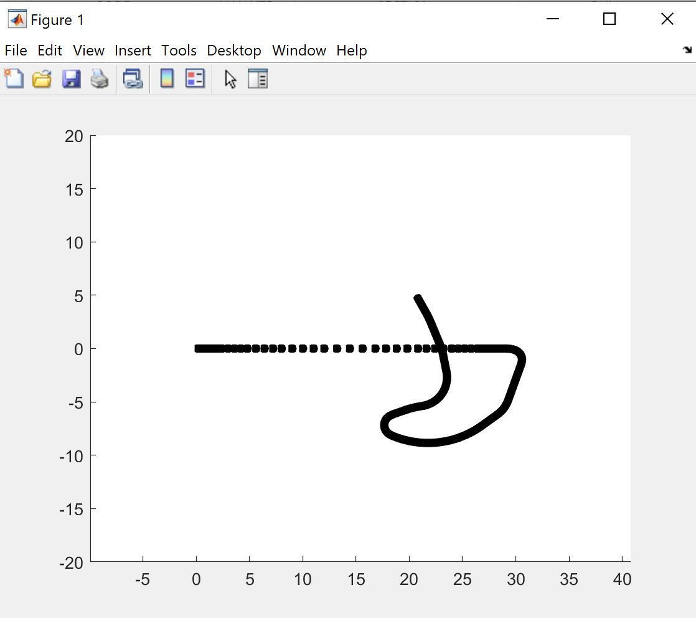

# Robotics-Enviroment-Simulation


## File 1


The code will have to show the trajectory performed over time by a robot equipped with tires on two-dimensional space.
The calculation of the position at the new time t + 1 is performed through a one-period transformation (combining the elementary transformations) with respect to the previous position.
The transformations are based on a file Archi_percorsi containing the readings of a motion encoder and the initial position of the robot into the file Positions.
Finally, the algorithm prints the degrees of freedom with respect to the origin on the screen.


```m
 Posizione : 
X : 20.836149 
Y : 4.677796 

Orientamento : 
theta : 119.357726°
```

```m
%analizzziamo scandendo il veddore delle acquisizione dell'encoder al tempo t=j  
for j=1:size(ssx,2)
    %se gli archi hanno la stessa dimensione il robot si muoverà dritto in
    %direzione dell'asse delle x , altrimenti ruterà
    if ssx(j)==sdx(j)
        r0Tr1=[1 0 sdx(j); 0 1 0; 0 0 1];
    else
        d = sdx(j)*b / (ssx(j)-sdx(j));
        deltaT = (ssx(j)-sdx(j))/b; %calcolo dell'angolo di rotazione
        mER = [ cos(deltaT) -sin(deltaT) ; sin(deltaT) cos(deltaT)];%matrice di rotazione elementare
        transition=[0 d+b/2];
        OT1 = [eye(2,2) -transition' ; 0 0 1 ];%trasformazione omogenea che descrive il frame in CIR t-1 rispetto a t-1
        OT2 = [ mER' zeros(2,1); 0 0 1];%trasformazione omogenea che descrive il frame CIR T rispetto al frame CIR t-1 ; mER'(deltaT)=mER(-delta)
        OT3 = [eye(2,2) transition' ; 0 0 1];%trasformazione omogenea che descrive il frame T rispetto al frame CIR t
        r0Tr1=OT1*OT2*OT3; %one_period_trasform  trasformazione omogenea 
    end
    
    wTr1 = wTr0 * r0Tr1; % aggiorniamo la trasformata omogenea che descrive il frame t rispetto al mondo moltiplicando wtr0 e roTr1(trasformata omogenea che descrive il frame t rispetto al frame t-1)
    newPose= wTr1 * Points; % moltiplichiamo i punti del robot per la trasformazione omogena wTr1 che trasforma i punti nella pose al tempo t
    wTr0 = wTr1; % assegno a wTr0 la nuova trasformata omogenea per ottenere il frame t-1 rispetto al mondo
    
```





## File 2
Il .m da sviluppare dovrà chiedere all'utente:

- di definire le dimensioni (larghezza - x, lunghezza - y ed altezza - z) di un parallelepipedo, si suggerisce di usare dimensioni molto diverse sui 3 assi, così da poterli distinguere visivamente;
- il sistema di riferimento del corpo viene messo nel centro della faccia inferiore con l'asse z lungo l'altezza
- di definire la pose 3D dell'oggetto nello spazio (gli angoli vanno chiesti all'utente in degs, please).


Successivamente dovrà effettuare:

- il disegno del sistema di riferimento del corpo, inizialmente coincidente con il sistema di riferimento del mondo (usate pure la convenzione x-y-z => r-g-b);
- il disegno del parallelepipedo nella pose indicata.
Poi dovrà chiedere all'utente:

- se vuole effettuare una trasformazione rigida rispetto agli assi world oppure body;
- di definire i parametri della roto-traslazione (gli angoli vanno chiesti all'utente in degs, please).


Dovrà quindi:

- effettuare il disegno degli assi del corpo e del parallelepipedo nella nuova pose (lasciate pure disegnato il sistema di riferimento ed il parallelepipedo nella pose precedente);
- chiedere all'utente se vuole effettuare un'altra trasformazione e tornare in ciclo oppure uscire a seconda delle risposta.


Al termine (quando l'utente avrà risposto negativamente alla domanda se vuole effettuare ulteriori rototraslazioni) il programma dovrà stampare a schermo i 6 DoF della pose finale nelle 2 seguenti versioni (gli angoli in degs, please):

- [x,y,z,α,β,γ], con α,β,γ angoli di Eulero1 (Z Y' Z'');
- [x,y,z,α,β,γ], con α,β,γ angoli di Eulero3 (roll pitch yaw).

## File 3


Il .m da sviluppare dovrà chiedere all'utente di definire le dimensioni di un parallelepipedo "base". Si suggerisce di usare dimensioni molto estese sui 2 assi x ed y, così che questo parallelepipedo venga per l'appunto a costituire il basamento su cui costruire il resto del sistema. Piazzate il sistema di riferimento sulla faccia superiore (non lasciate quindi il sistema di riferimento su uno spigolo del parallelepipedo). Questo primo parallelepipedo potrebbe quindi estendersi nel semispazio negativo delle z ed avere tutti i parametri di pose a zero. Successivamente il programma dovrà effettuare il disegno della base e del suo sistema di riferimento.

Quindi, considerando la z di questo sistema come l'asse di rotazione del "giunto 1" (la vita, per un braccio antropomorfo), chiedere all'utente di definire i parametri della pose 3D di un sistema di riferimento (angoli in degs, please) rispetto al sistema precedente; questo sarà il sistema di riferimento "frame0". Successivamente dovrà disegnare il sistema di riferimento "frame0".

Quindi dovrà chiedere all'utente di definire i parametri della pose 3D di un sistema di riferimento (angoli in degs, please) rispetto al sistema precedente; questo sarà il sistema di riferimento "frame0". Successivamente dovrà disegnare il sistema di riferimento "frame0".

Il programma dovrà poi chiedere all'utente di definire i parametri della pose 3D di un sistema di riferimento (angoli in degs, please) rispetto al sistema frame0 mediante i 4 parametri delle convenzioni DH; questo sarà il sistema di riferimento "frame1"; "theta" sarà di default la variabile di giunto. L'asse z di frame0 sarà l'asse di rotazione del "giunto 1" (la vita, per un braccio antropomorfo). Opzionalmente, il programma potrà chiedere all'utente di definire quale sia la variabile di giunto tra "theta" e "d". Successivamente dovrà disegnare il sistema di riferimento "frame1". Questa interazione con l'utente seguita da disegno dovrà essere replicata finché l'utente non risulti soddisfatto delle sue scelte (ad ogni ripetizione del ciclo interazione - disegno si dovrà cancellare il disegno precedente).

A questo punto il programma dovrà chiedere all'utente di definire un secondo parallelepipedo, che costituirà il "link0" (torso, per un antropomorfo); questo parallelepipedo verrà definito nel sistema di riferimento "frame1" e movimentato a seguito del movimento del giunto 1. Non è importante che il link0 sia coerente con le dimensioni della base, ad esempio se si compenetrano sono problemi dell'utente. Oltre alle dimensioni del parallelepipedo lungo gli assi di "frame1", andrà chiesto all'utente di definire una posizione del centro della faccia inferiore del parallelepipedo, ovviamente anche questo rispetto a "frame1". Successivamente dovrà effettuare il disegno dei 2 parallelepipedi (base e link0). Questa interazione con l'utente seguita da disegno dovrà essere replicata (per quanto riguarda link0) finché l'utente non risulti soddisfatto delle sue scelte (ad ogni ripetizione del ciclo interazione - disegno si dovrà cancellare il disegno precedente).

Dopo la conclusione del passo relativo al link0, il programma chiederà all'utente:

- se vuole movimentare il link0 (i.e., muovere il giunto 1);
- in caso affermativo di definire il valore del movimento (angoli in degs, please);
- effettuare il disegno di base e link0 con link0 nella nuova pose;
- chiedere all'utente se vuole effettuare un'altra trasformazione e tornare in ciclo oppure proseguire.


Il programma dovrà poi chiedere all'utente di definire i parametri della pose 3D di un sistema di riferimento (angoli in degs, please) rispetto al sistema precedente mediante i 4 parametri delle convenzioni DH; questo sarà il sistema di riferimento "frame2"; "theta" sarà di default la variabile di giunto. Opzionalmente, il programma potrà chiedere all'utente di definire quale sia la variabile di giunto tra "theta" e "d". Successivamente dovrà disegnare il sistema di riferimento "frame2". Questa interazione con l'utente seguita da disegno dovrà essere replicata finché l'utente non risulti soddisfatto delle sue scelte (ad ogni ripetizione del ciclo interazione - disegno si dovrà cancellare il disegno precedente).

A questo punto il programma dovrà chiedere all'utente di definire un terzo parallelepipedo, che costituirà il "link1" (braccio, per un antropomorfo); questo parallelepipedo verrà definito nel sistema di riferimento "frame2" e movimentato a seguito del movimento del giunto 2. Non è importante che il link1 sia coerente con le dimensioni di link0, ad esempio se si compenetrano sono problemi dell'utente. Oltre alle dimensioni del parallelepipedo lungo gli assi di "frame2", andrà chiesto all'utente di definire una posizione del centro della faccia inferiore del parallelepipedo, ovviamente anche questo rispetto a "frame2". Successivamente dovrà effettuare il disegno dei 3 parallelepipedi (base, link0 e link1). Questa interazione con l'utente seguita da disegno dovrà essere replicata (per quanto riguarda link1) finché l'utente non risulti soddisfatto delle sue scelte (ad ogni ripetizione del ciclo interazione - disegno si dovrà cancellare il disegno precedente).

Dopo la conclusione del passo relativo a link1, il programma chiederà all'utente:

- se vuole movimentare link1 (i.e., muovere il giunto 2) oppure link0 (i.e., muovere giunto 1) oppure uscire;
- in caso di movimentazione di uno dei giunti, di definire il valore del movimento (angoli in degs, please);
-  il disegno di base, link0 e link1 nella nuova pose;
- chiedere all'utente se vuole effettuare un'altra movimentazione e tornare in ciclo oppure proseguire
